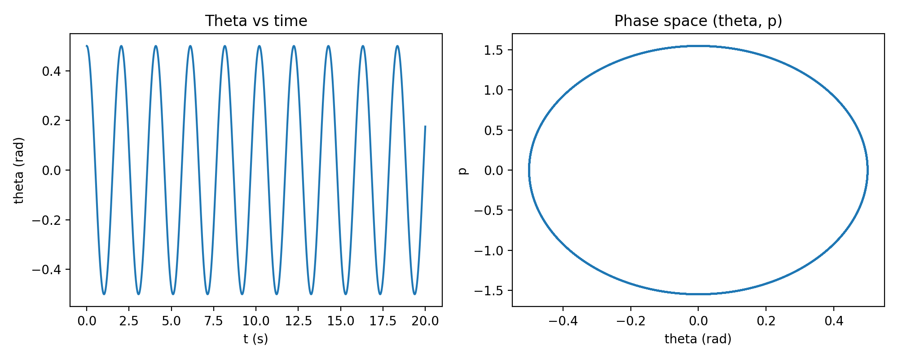

# Hamiltonian Mechanics — Assumption Hunt

This repository explores the **transition from the Lagrangian to the Hamiltonian formulation** of classical mechanics.  

## Contents
- `analysis.md` → Detailed "Assumption Hunt" notes
- `hamiltonian_plot.py` → Python script for generating phase space trajectories
- `hamilton_pendulum.png` → Generated phase space diagram

## Phase Space Visualization

## Learning Objective
The goal of this repo is to **develop deep intuition** about the philosophical and mathematical shift:
- From configuration space → to phase space  
- From forces → to canonical conjugates  

## Status
This project is part of **Day 8 of PhD Prep (Nova Plan)**.  
